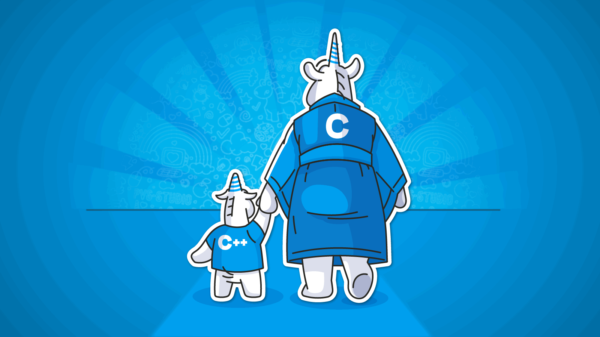

<h1 align="center">
  
</h1>

<p align="center">
  
  
  
</p>

<p align="center">
  <strong><code>█▓▒░ BUILDING BOLD SYSTEMS • SHIPPING REAL IMPACT ░▒▓█</code></strong>
</p>

<p align="center">
  
</p>

<p align="center">
  
</p>

<p align="center">
  <strong>Software Engineer • Cloud Enthusiast</strong>
</p>

<p align="center">
  I design and build practical software with clean architecture, strong fundamentals, and real-world impact.
</p>

---

## Identity

```yaml
name: Nkosimphile Khumalo
role: Software Engineer
education: BSc in IT
focus:
  - Software Engineering
  - Cloud Technologies
  - Real-world Product Development
mindset: "Build fast. Build clean. Build to last."
```

## Tech Arsenal

<p align="center">
  
</p>

<p align="center">
  
  
  
</p>

## Showcase

<p align="center">
  
  
</p>

## GitHub Analytics

<p align="center">
  
  
</p>

<p align="center">
  
</p>

<p align="center">
  
</p>

## Current Mission

- Ship polished projects that solve real problems
- Master modern software engineering patterns
- Grow deeper in cloud-native development
- Collaborate with builders who value excellence

<p align="center">
  
</p>

<p align="center">
  <strong>LET'S BUILD SOMETHING LEGENDARY.</strong>
</p>
